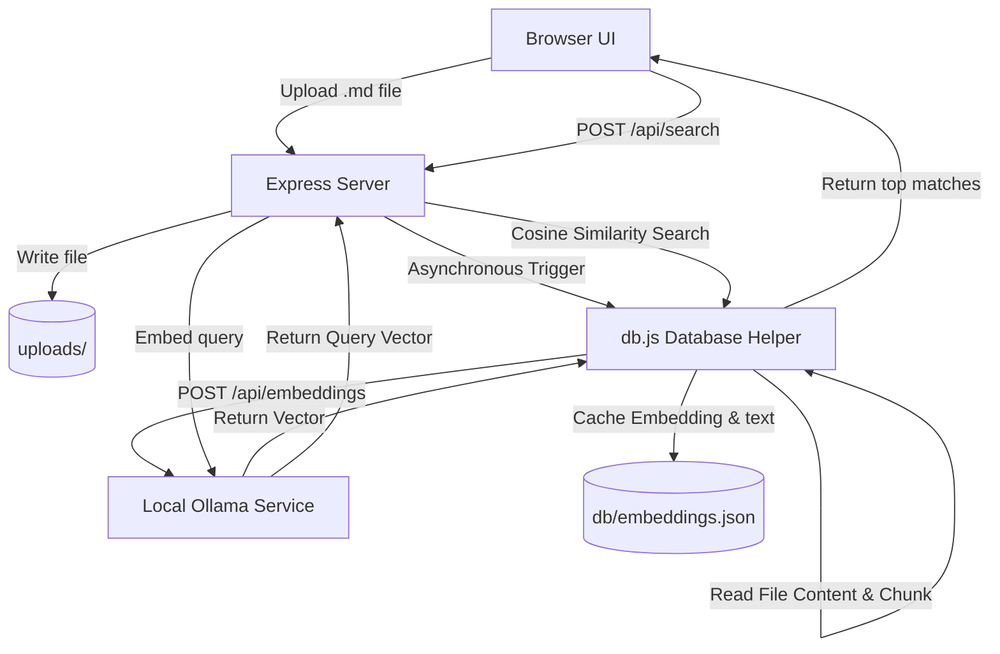

# Ollama Embeddings & Semantic Search Walkthrough

This document outlines the changes made to introduce local embeddings generation and semantic document search to the **Markdown Vault** (Soko) codebase.

---

## 🏗️ Architecture Design

We implemented a lightweight, serverless vector search architecture using:
1. **Ollama API**: Generates embeddings vectors for text chunks via a local model (default: `nomic-embed-text` with 768 dimensions).
2. **In-Memory JSON Vector Store (`db/embeddings.json`)**: Automatically tracks file metadata (size, upload date, status, chunks) and caches chunk texts with their corresponding floating-point embedding vectors.
3. **Vanilla JS Frontend**: A polished dark-mode dashboard using CSS Glassmorphism, complete with interactive semantic query input, similarity score badges, document lists, and Ollama connection checkers.



---

## 🛠️ File Changes & Additions

We created and modified several files within the project:

### 1. New Helper: [ollama.js](file:///home/iamhi/dev/oni/soko/ollama.js)
Handles all direct communications with the local Ollama instance:
* `checkOllamaConnection()`: Pings `/api/tags` to verify status and retrieve all downloaded models.
* `generateEmbedding(text)`: Calls Ollama's embeddings generation API (tries newer `/api/embed` first, then falls back to `/api/embeddings`).

### 2. New Database Store: [db.js](file:///home/iamhi/dev/oni/soko/db.js)
An in-memory JSON-based database for document storage:
* `chunkText(text)`: Splits markdown text into semantic sections (paragraphs of ~800 characters with 150 overlap) to generate context-rich embeddings.
* `cosineSimilarity(vecA, vecB)`: Computes alignment scores between embedding vectors.
* `indexFile(filename, filePath)`: Generates and indexes vectors asynchronously.
* `searchIndex(queryEmbedding)`: Ranks all chunks by relevance using cosine similarity.
* `removeFileFromIndex(filename)`: Deletes file vectors when files are soft-deleted.

### 3. Updated Server: [server.js](file:///home/iamhi/dev/oni/soko/server.js)
Binds the backend to standard local interfaces (`127.0.0.1`) and adds these endpoints:
* `POST /api/upload`: Triggers `indexFile` in the background asynchronously.
* `DELETE /api/files/:filename`: Clears file entries from the embeddings store.
* `GET /api/files`: Returns list of files and their current indexing statuses (`indexed`, `indexing`, `failed`).
* `POST /api/search`: Generates query vectors and performs semantic searches.
* `GET /api/ollama/status`: Exposes current Ollama status and installed models.
* `POST /api/files/:filename/reindex`: Re-indexes files.

### 4. Interactive Frontend: [index.html](file:///home/iamhi/dev/oni/soko/public/index.html) & [app.js](file:///home/iamhi/dev/oni/soko/public/app.js)
* **Ollama Connection Panel**: Live connection status, configured model name, and a list of installed models.
* **Semantic Search Panel**: Form with a result count slider and search results rendering matching text excerpts alongside match percentages.
* **Vault Documents List**: Renders all documents in storage, metadata, indexing status badges (success/loading/error), and actions (Delete/Re-index).

---

## ⚡ API Endpoint Reference

| Endpoint | Method | Payload | Description |
| :--- | :--- | :--- | :--- |
| `/api/upload` | `POST` | `multipart/form-data` (file) | Upload markdown file and start background indexing |
| `/api/files` | `GET` | *None* | Get list of vault files and indexing status |
| `/api/files/:filename` | `DELETE` | *None* | Soft-delete document and remove its embeddings |
| `/api/files/:filename/reindex` | `POST` | *None* | Manually trigger indexing for a document |
| `/api/search` | `POST` | `{ "query": string, "limit": number }` | Search document vault semantically |
| `/api/ollama/status` | `GET` | *None* | Retrieve connection status and available models |

---

## 🧪 Verification & Testing

1. **Verify Ollama Connection**:
   ```bash
   curl -s http://127.0.0.1:3000/api/ollama/status
   ```
   *Expected:* `{"online":true,"models":["nomic-embed-text:latest"],"currentModel":"nomic-embed-text","host":"http://127.0.0.1:11434"}`

2. **Retrieve Stored Files**:
   ```bash
   curl -s http://127.0.0.1:3000/api/files
   ```
   *Expected:* Renders array of document items with `"status":"indexed"`.

3. **Query Semantic Search**:
   ```bash
   curl -s -X POST -H "Content-Type: application/json" -d '{"query": "document retrieval"}' http://127.0.0.1:3000/api/search
   ```
   *Expected:* Returns matches sorted by descending similarity scores with file names and chunk contents.
